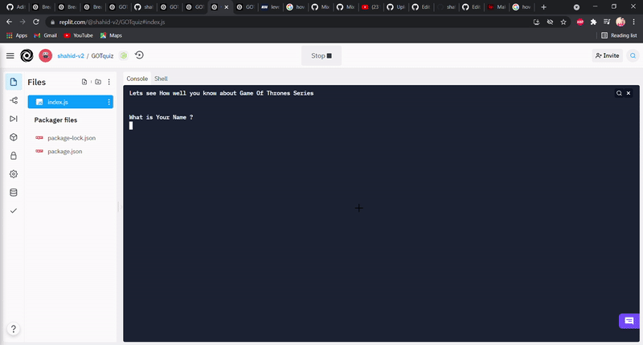

# GOT FANDOM QUIZ
 A command line interface quiz about GOT written in nodeJS and developed on collaborative browser based IDE repl.it.
### Package Managers
 * readline-sync

### Features
* Users can type their name in terminal.
* Users have to select one option in each question.
* Based on their answers, they will be given scores.
### Demo 👇

